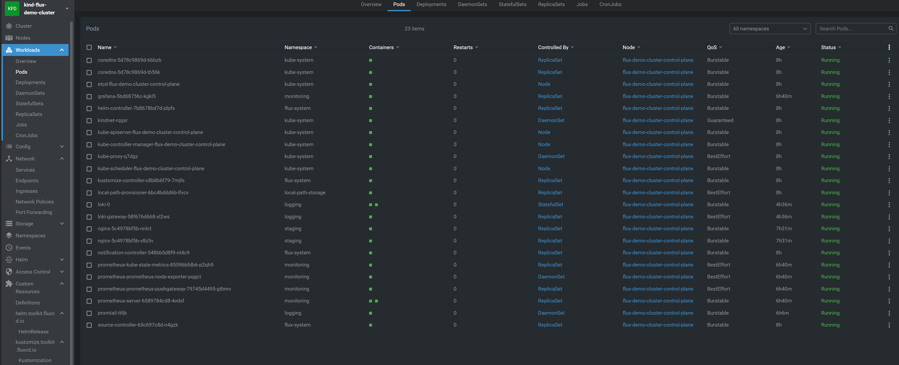
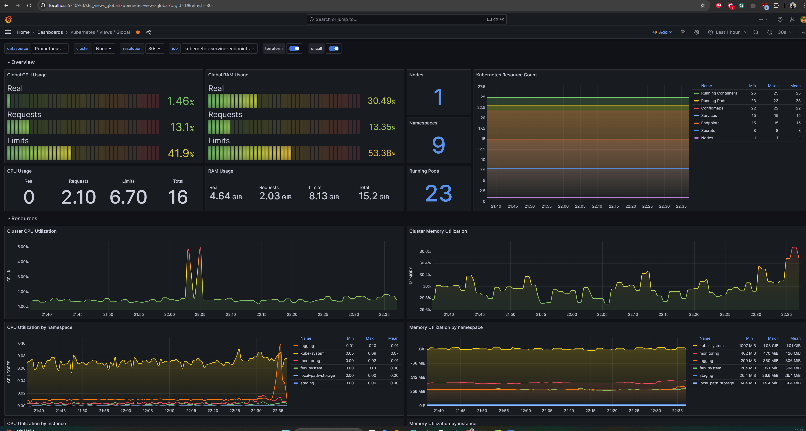
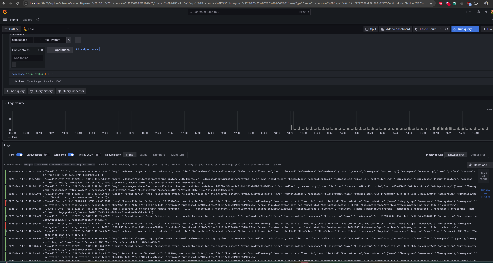

# **GitOps with Flux on Kind (Kubernetes in Docker) - Complete Setup Guide**


### Directory Structure
```
├── cluster/
│   └── terraform/
│       ├── main.tf
│       ├── variables.tf
│       ├── outputs.tf
│       ├── providers.tf
│       ├── versions.tf
│       └── local.tf
├── flux/
│   └── terraform/
│       ├── main.tf
│       ├── variables.tf
│       ├── outputs.tf
│       ├── providers.tf
│       ├── versions.tf
│       └── local.tf
├── kubernetes/
│   ├── apps/
│   │   ├── base/          # Common manifests
│   │   │   └── nginx/      # Environment patches
│   │   └── environments/      # Environment patches
│   │       ├── staging/          # Common manifests
│   │       └── production/      # Environment patches
│   ├── monitoring/
│   │   ├── prometheus/
│   │   ├── grafana/
│   │   ├── helmrepositories.yaml
│   │   └── kustomization.yaml
│   └── logging/
│       ├── loki/
│       ├── Promtail/
│       ├── helmrepositories.yaml
│       └── kustomization.yaml
```

This project demonstrates a **complete GitOps workflow** using **Flux CD** on a **Kind (Kubernetes in Docker)** cluster. It includes:
- ✅ **Flux CD** for GitOps automation
- ✅ **Multi-environment (staging/production)** deployments
- ✅ **Monitoring** (Prometheus + Grafana)
- ✅ **Logging** (loki, Promtail)
- ✅ **Automated rollbacks** on health check failures
- ✅ **Infrastructure as Code** (Terraform + Kustomize)

---

## **🚀 Prerequisites**
Before you begin, ensure you have installed:

| Tool | Installation Guide                                                                                   |
|------|------------------------------------------------------------------------------------------------------|
| **Docker** | [Install Docker](https://docs.docker.com/get-docker/)                                                |
| **Kind** | [Install Kind](https://kind.sigs.k8s.io/docs/user/quick-start/#installing-from-source)               |
| **kubectl** | [Install kubectl](https://kubernetes.io/docs/tasks/tools/)                                           |
| **Terraform** | [Install Terraform](https://developer.hashicorp.com/terraform/tutorials/aws-get-started/install-cli) |
| **Flux CLI** | [Install FluxCD](https://fluxcd.io/flux/installation/)                                               |
| **GitHub Account** | [Create a Personal Access Token (PAT)](https://github.com/settings/tokens) (with `repo` permissions) |

---

## **📥 Setup Instructions**

### **1️⃣ Clone the Repository**
```bash
git clone https://github.com/usamacheema786/gitopsflux.git
cd gitopsflux


# 1. Create Kind cluster
cd cluster/terraform
terraform init
terraform apply
```
- kube-config will be automatically saved to cluster/ directory then you can use it via Lens or other tool to visaualize your cluster

```
# 2. Install Flux
cd flux/terraform
terraform init
terraform apply \
  -var="git_username=<your-github-username>" \
  -var="github_token=<your-personal-access-token>"
  
# 3. Verify
flux check
kubectl get pods -n flux-system
```
- Pull the latest from the repo after bootstrap the cluster
- Terraform will also create the required namespaces and
### Create and push the application manifest file to repository
```
4️⃣ Deploy Your Application via GitOps
   The NGINX app manifests are structured with Kustomize:
├── kubernetes/   
│   ├── apps/
│   │   ├── base/          # Common manifests
│   │   └── environments/      # Environment patches
```
### Flux watches this directory via the Kustomization CRD under flux/clusters/kind:
- While boottraping terraform will also create staging (Kustomization) will be generated to make CD for application deployment into ``` flux/clusters/kind``` directory
```
apiVersion: kustomize.toolkit.fluxcd.io/v1
kind: Kustomization
metadata:
  name: staging-app
  namespace: flux-system
spec:
  interval: 1m
  path: "./apps/environments/staging/nginx"
  targetNamespace: staging
  prune: true
  healthChecks:  # healthCheck to perform auto rollback when health check fails
    - apiVersion: apps/v1
      kind: Deployment
      name: nginx
      namespace: staging
  timeout: 2m
  retryInterval: 30s
  sourceRef:
    kind: GitRepository
    name : flux-system
    namespace : flux-system

# Included readiness and liveness probes for automatic rollback in case of failed health check

```
- Push your changes and Flux will reconcile and apply them within 1 minute. 

#### 🔁 GitOps Sync Strategy
- Apps (like nginx) are defined in environments and applied using Flux’s Kustomization controller.
- Monitoring & Logging are deployed via Helm charts (using Helm Compoment of Flux) — defined declaratively in:
  - kubernetes/monitoring/kustomization.yaml
  - kubernetes/logging/kustomization.yaml
- then define final kustomization file and push the changes
    - flux/clusters/kind/kustomization.yaml


### 📌 Best Practices Implemented
- ✅ RBAC + Namespaces for isolation
- ✅ Health checks with rollback enabled
- ✅ Git as the single source of truth
- ✅ Infra automation with Terraform
- ✅ Clean environment separation (Staging/Prod)
- ✅ Observability and centralized logs


## Secreenshots:
- Cluster overview


- Monitoring overview


- logging overview
- 
